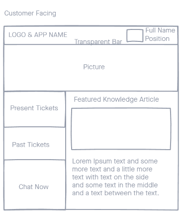
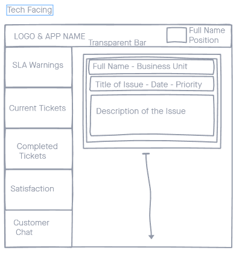
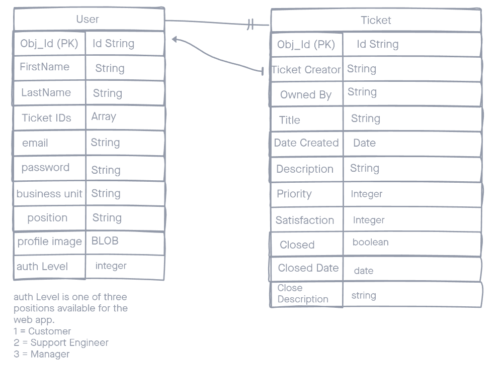
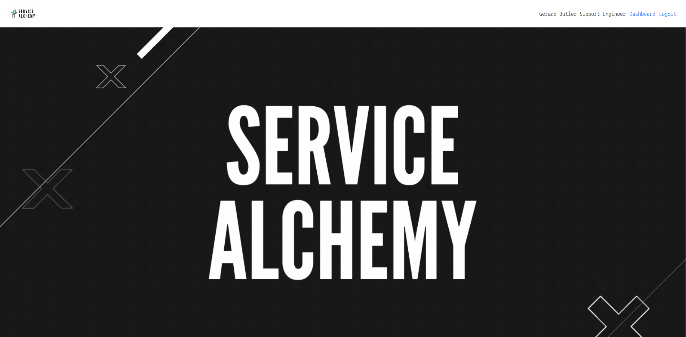
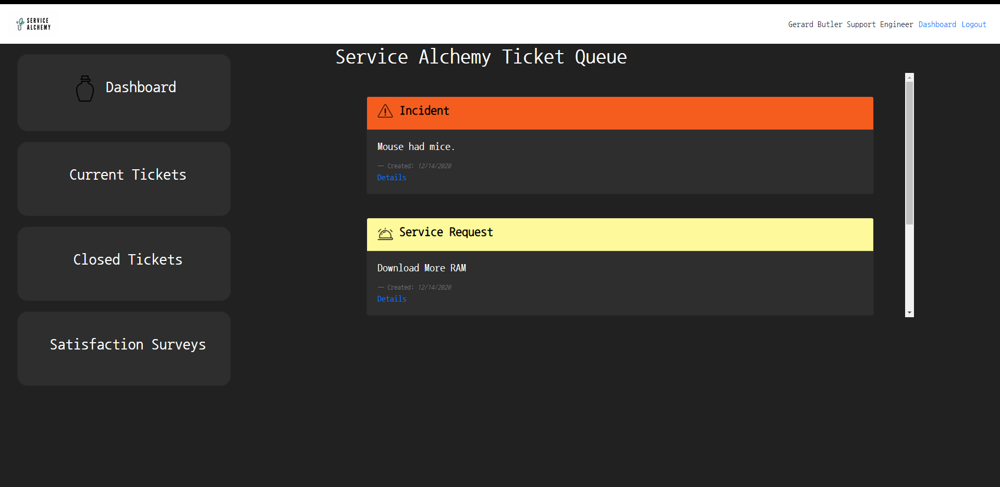
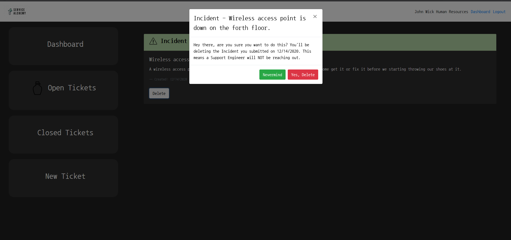
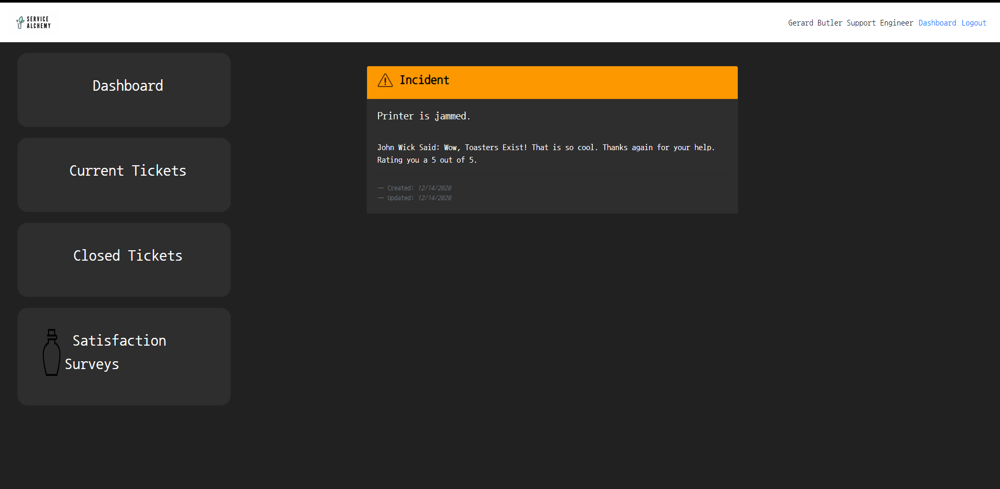

# Welcome To Service Alchemy

Service Alchemy is an IT Service and Customer Relationship Management tool built in the MERN stack as a learning project. 

### Project Management

[Trello Board](https://trello.com/b/fhqKDr88/project3)

### Wireframes

These wireframes guided the inital construction of the site.

#### The Entity Relationship Diagram 

---

### Screenshots

## Technologies Used

- MongoDB
- Express 
- React
- NodeJS
- AJAX
- BOOTSTRAP 4
- Heroku

## Getting Started

The project is pretty straight forward to get started. Clone this repo and travel to the same directory as the package.json file. Once there enter the `npm i` command in the terminal.
You'll need to traverse over to the services folder and change all the BASE_URLS to development environment addresses. These are most commonly http://localhost:3000 for frontend and http://localhost:3001 .
Once those are changed start the frontend development environment by typing `npm start`. Make sure you setup the backend before you try experimenting with the front.  

## Unsolved Problems

I still need to add authentication differences for Customers accessing the support dashboard and vice versa.

The update ticket function does not pre-populate with the old information and I would like it to.

## Future Enhancements

 - Implement socket.io for real time chat between engineers and customers.

 - Email interface that is tracks communication between customer and tech on tickets.

 - Add a manager dashboard to manage techs and visualize productivity.

 
# TRY ME OUT!!!

[Deploy](https://crm-service-alchemy.herokuapp.com/)